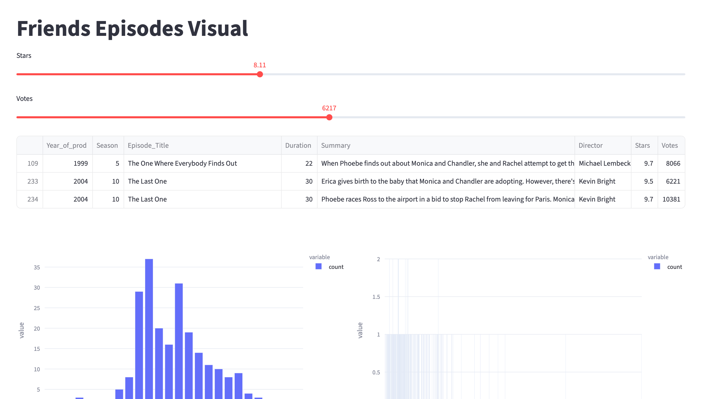

# Friends Episodes Visual

Um projeto simples em **Streamlit** para explorar episódios da série *Friends* usando dados de avaliação e número de votos.

 

## Funcionalidades

- Filtrar episódios por **Stars** e **Votes** usando sliders interativos.
- Visualizar gráficos de barras das distribuições de **Stars** e **Votes** com **Plotly**.

## Tecnologias

- Python
- Pandas
- Streamlit
- Plotly Express

## Como usar

1. Clone o repositório.
2. Instale as dependências:
   ```bash
   pip install pandas streamlit plotly
   

